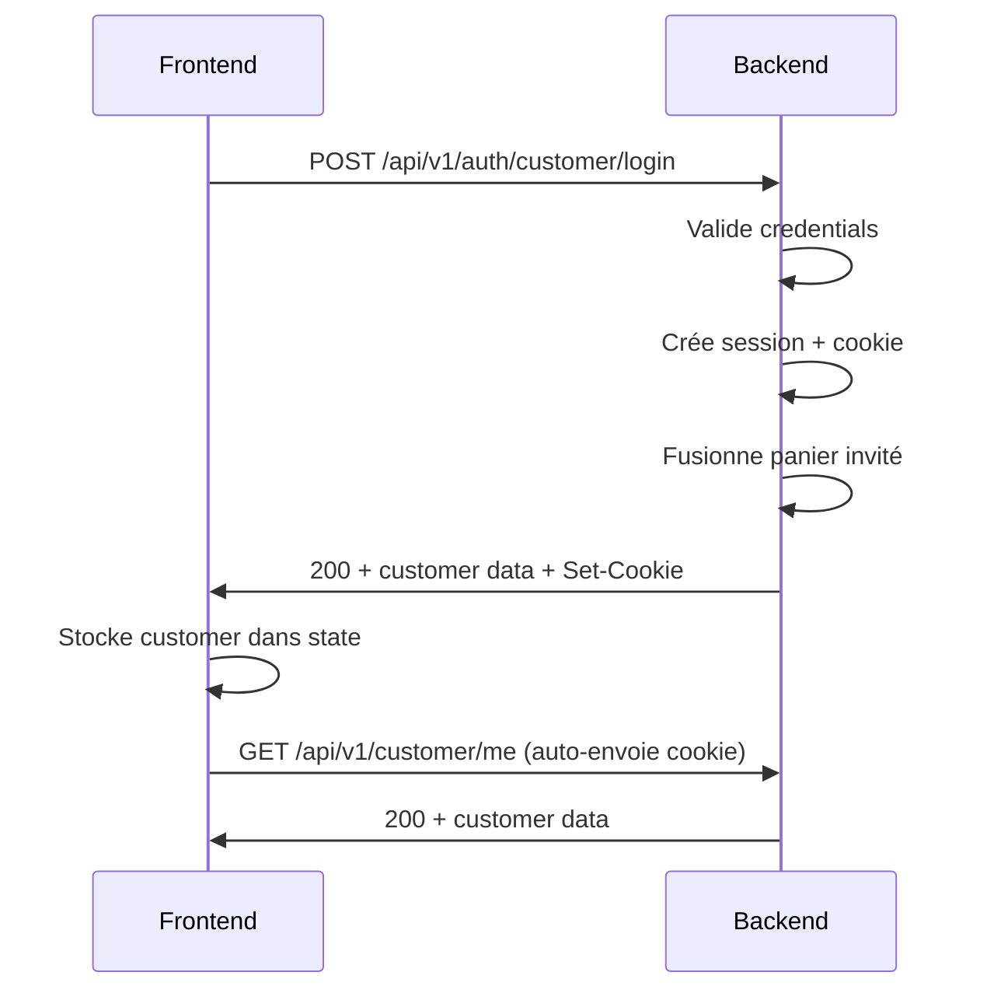
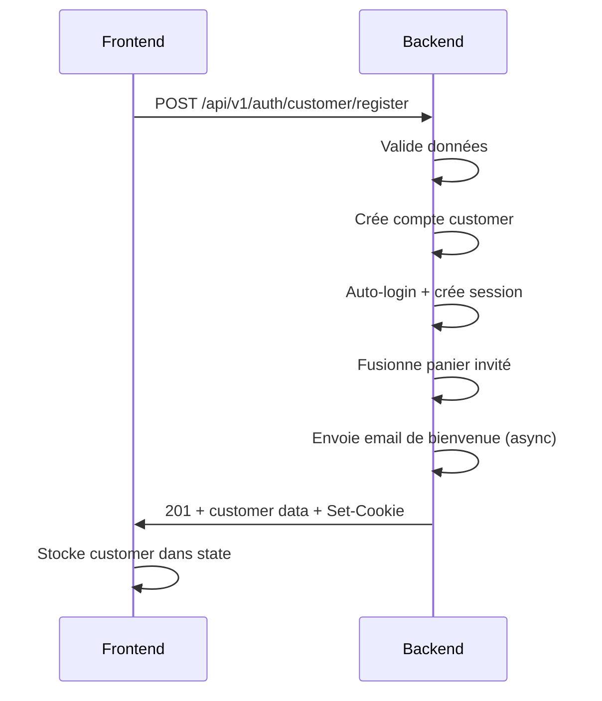
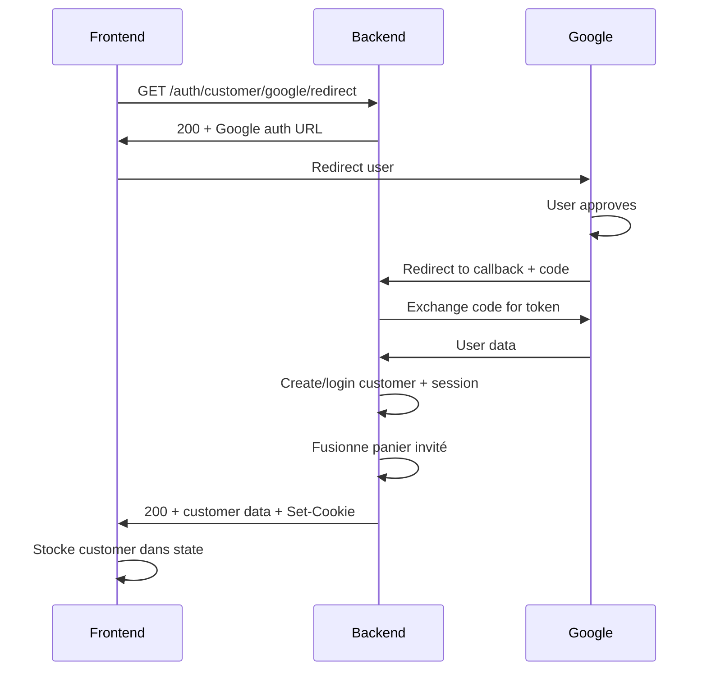

# Spécifications API - Authentification Customer

Ce document détaille **exactement** ce que le backend attend pour chaque endpoint d'authentification client. Utilisez cette référence pour implémenter votre intégration frontend.

---

## 🔑 Vue d'ensemble

L'API utilise une **authentification par session avec cookies HTTP-only** (guard: `customer`).

> **Important** : Les endpoints utilisent des sessions avec cookies HTTP-only. Le frontend **ne gère pas** directement les tokens. Les cookies sont automatiquement gérés par le navigateur.

---

## 📍 Base URLs

- **Routes publiques (auth)** : `/api/v1/auth/customer/`
- **Routes customer protégées** : `/api/v1/customer/`

---

## 👤 Authentification Customer

### 1. Inscription Customer

**Endpoint** : `POST /api/v1/auth/customer/register`

**Rate Limit** : 5 requêtes par minute

**Headers requis** :
```http
Content-Type: application/json
Accept: application/json
```

**Body (JSON)** :
```json
{
  "first_name": "Marie",
  "last_name": "Dupont",
  "email": "marie@example.com",
  "password": "SecurePass123!",
  "password_confirmation": "SecurePass123!",
  "phone": "+229 97 11 22 33"
}
```

**Règles de validation** :

| Champ | Type | Requis | Règles |
|-------|------|--------|--------|
| `first_name` | string | ✅ Oui | Max 255 caractères |
| `last_name` | string | ✅ Oui | Max 255 caractères |
| `email` | string | ✅ Oui | Email valide, unique dans la table `customers` |
| `password` | string | ✅ Oui | Min 8 caractères |
| `password_confirmation` | string | ✅ Oui | Doit correspondre à `password` |
| `phone` | string | ❌ Non | Max 20 caractères |

**Réponse succès (201)** :
```json
{
  "success": true,
  "message": "Registration successful",
  "data": {
    "customer": {
      "id": "uuid-here",
      "first_name": "Marie",
      "last_name": "Dupont",
      "email": "marie@example.com",
      "phone": "+229 97 11 22 33",
      "status": "active",
      "created_at": "2024-12-03T12:00:00.000000Z",
      "updated_at": "2024-12-03T12:00:00.000000Z"
    }
  }
}
```

**Note importante** :
- Le client est **automatiquement connecté** après l'inscription
- Un email de bienvenue est envoyé en arrière-plan
- Le panier invité est fusionné automatiquement (si un `session_id` existe dans les cookies)

---

### 2. Connexion Customer

**Endpoint** : `POST /api/v1/auth/customer/login`

**Rate Limit** : 10 requêtes par minute

**Headers requis** :
```http
Content-Type: application/json
Accept: application/json
```

**Body (JSON)** :
```json
{
  "email": "marie@example.com",
  "password": "SecurePass123!"
}
```

**Règles de validation** :

| Champ | Type | Requis | Règles |
|-------|------|--------|--------|
| `email` | string | ✅ Oui | Email valide |
| `password` | string | ✅ Oui | Chaîne de caractères |

**Réponse succès (200)** :
```json
{
  "success": true,
  "message": "Login successful",
  "data": {
    "customer": {
      "id": "uuid-here",
      "first_name": "Marie",
      "last_name": "Dupont",
      "email": "marie@example.com",
      "status": "active",
      "addresses": [
        {
          "id": "address-uuid",
          "type": "billing",
          "first_name": "Marie",
          "last_name": "Dupont",
          "address_line_1": "123 Rue Example",
          "city": "Cotonou",
          "is_default": true
        }
      ]
    }
  }
}
```

**Réponse erreur (422)** :
```json
{
  "message": "The provided credentials are incorrect.",
  "errors": {
    "email": [
      "The provided credentials are incorrect."
    ]
  }
}
```

**Réponse erreur (403)** :
```json
{
  "success": false,
  "message": "Account is not active"
}
```

**Note importante** :
- Les tentatives de connexion échouées sont enregistrées avec l'IP
- Le panier invité est automatiquement fusionné avec le panier du client
- Les adresses du client sont chargées automatiquement

---

### 3. Déconnexion Customer

**Endpoint** : `POST /api/v1/customer/logout`

**Rate Limit** : 120 requêtes par minute

**Authentification** : ✅ Requise (cookie de session)

**Headers requis** :
```http
Accept: application/json
```

**Body** : Aucun

**Réponse succès (200)** :
```json
{
  "success": true,
  "message": "Logged out successfully",
  "data": null
}
```

---

### 4. Obtenir le client connecté

**Endpoint** : `GET /api/v1/customer/me`

**Rate Limit** : 120 requêtes par minute

**Authentification** : ✅ Requise (cookie de session)

**Headers requis** :
```http
Accept: application/json
```

**Réponse succès (200)** :
```json
{
  "success": true,
  "data": {
    "id": "uuid-here",
    "first_name": "Marie",
    "last_name": "Dupont",
    "email": "marie@example.com",
    "phone": "+229 97 11 22 33",
    "status": "active",
    "created_at": "2024-12-03T12:00:00.000000Z"
  }
}
```

---

### 5. Connexion Google OAuth (Customer)

#### 5a. Redirection vers Google

**Endpoint** : `GET /api/v1/auth/customer/google/redirect`

**Rate Limit** : 10 requêtes par minute

**Headers requis** :
```http
Accept: application/json
```

**Query Parameters** :

| Paramètre | Type | Requis | Description |
|-----------|------|--------|-------------|
| `redirect_url` | string | ❌ Non | URL de redirection après auth (frontend) |

**Exemple** :
```
GET /api/v1/auth/customer/google/redirect?redirect_url=https://myapp.com/auth/callback
```

**Réponse succès (200)** :
```json
{
  "success": true,
  "data": {
    "url": "https://accounts.google.com/o/oauth2/auth?client_id=...&redirect_uri=...&scope=..."
  }
}
```

**Instructions frontend** :
1. Appelez cet endpoint pour obtenir l'URL Google
2. Stockez `redirect_url` dans localStorage/sessionStorage si fourni
3. Redirigez l'utilisateur vers l'URL retournée (`data.url`)

---

#### 5b. Callback Google

**Endpoint** : `GET /api/v1/auth/customer/google/callback`

**Rate Limit** : 10 requêtes par minute

**Headers requis** :
```http
Accept: application/json
```

**Query Parameters** (automatiquement fournis par Google) :

| Paramètre | Type | Requis | Description |
|-----------|------|--------|-------------|
| `code` | string | ✅ Oui | Code d'autorisation de Google |
| `state` | string | ❌ Non | État optionnel pour vérification |

**Exemple** :
```
GET /api/v1/auth/customer/google/callback?code=4/0AX4XfWh...&state=xyz
```

**Réponse succès (200)** :
```json
{
  "success": true,
  "message": "Successfully authenticated with Google",
  "data": {
    "customer": {
      "id": "uuid-here",
      "first_name": "Marie",
      "last_name": "Dupont",
      "email": "marie@gmail.com",
      "google_id": "google-user-id",
      "status": "active"
    },
    "is_new_customer": false
  }
}
```

**Notes importantes** :
- Si l'email Google existe déjà → Connexion du compte existant
- Si l'email Google n'existe pas → Création d'un nouveau compte
- Le client est automatiquement connecté après le callback
- Le panier invité est fusionné automatiquement
- `is_new_customer` indique si c'est une nouvelle inscription (true) ou connexion (false)

---

## 🔒 Gestion des Sessions & Cookies

### Configuration frontend requise

Pour que l'authentification par cookies fonctionne correctement avec une SPA (Nuxt/React/Vue), vous devez :

#### 1. Configuration Axios/Fetch

```javascript
// Exemple avec Axios
const api = axios.create({
  baseURL: 'https://api.votredomaine.com',
  withCredentials: true, // ✅ CRUCIAL : Envoie les cookies
  headers: {
    'Accept': 'application/json',
    'Content-Type': 'application/json'
  }
})
```

```javascript
// Exemple avec Fetch
fetch('https://api.votredomaine.com/api/v1/auth/customer/login', {
  method: 'POST',
  credentials: 'include', // ✅ CRUCIAL : Envoie les cookies
  headers: {
    'Accept': 'application/json',
    'Content-Type': 'application/json'
  },
  body: JSON.stringify({ email: '...', password: '...' })
})
```

#### 2. Gestion CSRF (si activé)

Laravel utilise la protection CSRF pour les routes web. Si vous utilisez Sanctum :

```javascript
// Obtenir le cookie CSRF avant toute requête POST/PUT/DELETE
await axios.get('/sanctum/csrf-cookie')

// Ensuite, toutes les requêtes incluront automatiquement le token CSRF
await axios.post('/api/v1/auth/customer/login', { email, password })
```

#### 3. Domaines et CORS

- Le frontend et le backend doivent être sur le **même domaine** ou **sous-domaines**
- Exemples valides :
  - Frontend : `https://app.votredomaine.com`
  - Backend : `https://api.votredomaine.com`
- Configuration CORS backend (déjà configurée) :
  ```php
  'supports_credentials' => true
  ```

---

## ⚠️ Gestion des erreurs

### Codes HTTP courants

| Code | Signification | Action frontend |
|------|---------------|-----------------|
| 200 | Succès | Traiter les données |
| 201 | Créé | Ressource créée avec succès |
| 401 | Non authentifié | Rediriger vers login |
| 403 | Non autorisé | Afficher message d'erreur |
| 422 | Validation échouée | Afficher erreurs de validation |
| 429 | Trop de requêtes | Attendre avant de réessayer |
| 500 | Erreur serveur | Afficher message générique |

### Format des erreurs de validation (422)

```json
{
  "message": "The given data was invalid.",
  "errors": {
    "email": [
      "The email field is required.",
      "The email must be a valid email address."
    ],
    "password": [
      "The password must be at least 8 characters."
    ]
  }
}
```

**Comment afficher** :
```javascript
if (error.response.status === 422) {
  const errors = error.response.data.errors
  // Afficher chaque erreur à côté du champ correspondant
  Object.keys(errors).forEach(field => {
    errors[field].forEach(message => {
      showFieldError(field, message)
    })
  })
}
```

---

## 🔄 Flux d'authentification recommandés

### Flux de connexion classique



### Flux d'inscription



### Flux Google OAuth



---

## 📋 Checklist d'implémentation frontend

- [ ] Configurer `withCredentials: true` / `credentials: 'include'`
- [ ] Implémenter formulaire de login avec gestion d'erreurs
- [ ] Implémenter formulaire d'inscription avec gestion d'erreurs
- [ ] Créer store/context pour le customer connecté
- [ ] Implémenter `logout` avec nettoyage du state
- [ ] Implémenter `me` pour vérifier la session au chargement de l'app
- [ ] Gérer les redirections 401 → page de login
- [ ] Afficher les erreurs de validation (422) sur les champs
- [ ] Implémenter rate limiting feedback (429)
- [ ] Gérer la fusion du panier invité après login
- [ ] Implémenter Google OAuth flow (redirect → callback)
- [ ] Afficher un loader/spinner pendant les requêtes d'authentification
- [ ] Gérer la persistance locale de l'état (optionnel, pour UX)

---

## 💡 Exemples d'intégration

### Exemple Nuxt 3 (Composition API)

```typescript
// stores/auth.ts
import { defineStore } from 'pinia'

export const useAuthStore = defineStore('auth', () => {
  const customer = ref(null)
  const isAuthenticated = computed(() => customer.value !== null)

  const login = async (email: string, password: string) => {
    try {
      const { data } = await $fetch('/api/v1/auth/customer/login', {
        method: 'POST',
        credentials: 'include',
        body: { email, password }
      })
      customer.value = data.customer
      return { success: true }
    } catch (error: any) {
      if (error.response?.status === 422) {
        return { success: false, errors: error.response.data.errors }
      }
      throw error
    }
  }

  const logout = async () => {
    await $fetch('/api/v1/customer/logout', {
      method: 'POST',
      credentials: 'include'
    })
    customer.value = null
  }

  const fetchUser = async () => {
    try {
      const { data } = await $fetch('/api/v1/customer/me', {
        credentials: 'include'
      })
      customer.value = data
    } catch (error) {
      customer.value = null
    }
  }

  return { customer, isAuthenticated, login, logout, fetchUser }
})
```

### Exemple React (avec Context)

```typescript
// contexts/AuthContext.tsx
import { createContext, useContext, useState } from 'react'
import axios from 'axios'

const api = axios.create({
  baseURL: 'https://api.votredomaine.com',
  withCredentials: true
})

export const AuthContext = createContext(null)

export const AuthProvider = ({ children }) => {
  const [customer, setCustomer] = useState(null)

  const login = async (email, password) => {
    try {
      const { data } = await api.post('/api/v1/auth/customer/login', {
        email,
        password
      })
      setCustomer(data.data.customer)
      return { success: true }
    } catch (error) {
      if (error.response?.status === 422) {
        return { success: false, errors: error.response.data.errors }
      }
      throw error
    }
  }

  const logout = async () => {
    await api.post('/api/v1/customer/logout')
    setCustomer(null)
  }

  return (
    <AuthContext.Provider value={{ customer, login, logout }}>
      {children}
    </AuthContext.Provider>
  )
}
```

---

## 🎯 Points clés à retenir

1. **Cookies HTTP-only** : Pas de gestion de tokens JWT côté frontend
2. **`withCredentials: true`** : OBLIGATOIRE sur toutes les requêtes
3. **Validation** : Toujours gérer les erreurs 422 avec affichage par champ
4. **Rate limiting** : Implementer des feedbacks visuels pour les erreurs 429
5. **Session check** : Appeler `/me` au chargement de l'app pour vérifier la session
6. **Panier invité** : Automatiquement fusionné après login (Customer)
7. **Google OAuth** : Flux en 2 étapes (redirect → callback)

---

## 📞 Support

Pour toute question sur l'intégration, contactez l'équipe backend.

**Version** : 1.0  
**Dernière mise à jour** : 3 décembre 2024
